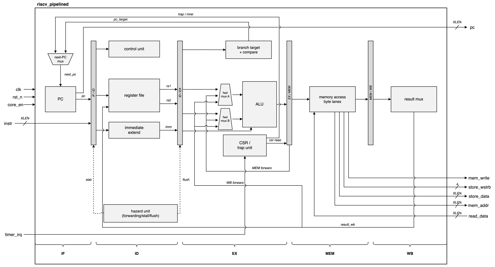
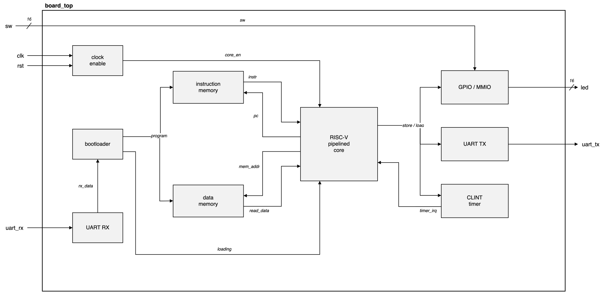
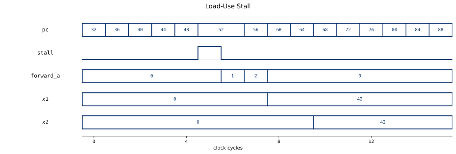
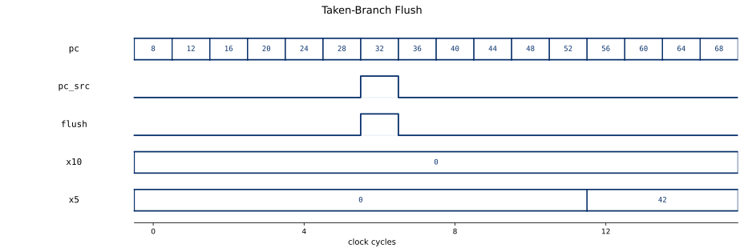

# riscv-pipelined

[](https://github.com/drewbabel/riscv-pipelined/actions/workflows/ci.yml)

A five-stage pipelined RV32I processor with hardware hazard resolution and machine-mode traps that runs CoreMark on a Basys 3, written in SystemVerilog.

The core executes the RV32I base integer instruction set across the classic instruction fetch (IF), instruction decode (ID), execute (EX), memory (MEM), and write-back (WB) stages, retiring one instruction per clock in steady state. Pipeline registers carry the datapath and control state across each stage boundary, the `control_unit` decodes in ID, the register file supplies operands, the `alu` computes in EX, and the ALU result, a loaded word, a CSR value, or the return address writes back in WB.

The `hazard_unit` preserves correct execution across the overlapped instructions. An instruction whose operand is still in flight receives the value forwarded from the MEM or WB stage instead of the stale register file copy. A load followed immediately by a dependent instruction cannot forward in time, so the unit inserts a one-cycle stall. Branches and jumps resolve in EX, and a taken branch flushes the two younger instructions already in the pipeline.

The `csr` block holds the machine-mode registers and the trap unit. On an exception or an enabled timer interrupt the trap unit records the faulting program counter in `mepc` and the reason in `mcause`, redirects the fetch to the `mtvec` handler, and cancels the younger instructions behind the trapping one. An `mret` restores the interrupt-enable stack and returns to `mepc`. The `clint` block raises the timer interrupt once its memory-mapped `mtime` reaches `mtimecmp`.

The core, testbenches, and formal proofs were written from scratch. The board system reuses the formally proven `uart_tx` and `uart_rx` from the standalone UART project. A riscv-formal proof under SymbiYosys checks the pipelined core against the RISC-V specification, and CoreMark validates the full system on real hardware.



## Parameters

| Parameter | Default | Description |
|-----------|---------|-------------|
| `XLEN` | `32` | Data and register width |
| `DEPTH` | `64` | Memory depth in words, raised to `16384` for the Basys 3 system |
| `ClkDiv` | `32` | Board clock-enable divisor, 3 on the validated bitstream |

## Interface

| Signal | Direction | Width | Description |
|--------|-----------|-------|-------------|
| `clk` | in | 1 | System clock |
| `core_en` | in | 1 | Clock enable that advances the pipeline one step |
| `rst_n` | in | 1 | Synchronous active-low reset |
| `instr` | in | `XLEN` | Fetched instruction word |
| `read_data` | in | `XLEN` | Load data returned from memory |
| `timer_irq` | in | 1 | CLINT machine-timer interrupt |
| `pc` | out | `XLEN` | Program counter of the fetched instruction |
| `mem_write` | out | 1 | Data memory write strobe |
| `alu_result` | out | `XLEN` | ALU output of the MEM-stage instruction |
| `write_data` | out | `XLEN` | Raw store operand from the register file |
| `store_wstrb` | out | 4 | Per-byte write strobe for the store |
| `store_data` | out | `XLEN` | Store data aligned to the addressed byte lanes |
| `mem_addr` | out | `XLEN` | Data memory address |

## Instructions

| Format | Instructions |
|--------|--------------|
| Register (`OP`) | `add` `sub` `sll` `slt` `sltu` `xor` `srl` `sra` `or` `and` |
| Immediate (`OP-IMM`) | `addi` `slti` `sltiu` `xori` `ori` `andi` `slli` `srli` `srai` |
| Load (`LOAD`) | `lb` `lbu` `lh` `lhu` `lw` |
| Store (`STORE`) | `sb` `sh` `sw` |
| Branch (`BRANCH`) | `beq` `bne` `blt` `bge` `bltu` `bgeu` |
| Jump | `jal` `jalr` |
| Upper immediate | `lui` `auipc` |
| System | `ecall` `ebreak` `mret` |
| Zicsr | `csrrw` `csrrs` `csrrc` `csrrwi` `csrrsi` `csrrci` |

The `FENCE` instruction is a no-op, and the core runs entirely in machine mode.

## Hazards

| Hazard | Resolution |
|--------|------------|
| Operand still in MEM or WB | Forward into the EX operand muxes |
| Load followed by a dependent instruction | One-cycle stall, then forward |
| Taken branch or jump, resolved in EX | Flush the two younger instructions |

## Machine mode

The core traps illegal instructions, `ecall`, `ebreak`, and misaligned instruction, load, and store addresses, and takes the CLINT timer interrupt when `mstatus` and `mie` enable it.

| CSR | Purpose |
|-----|---------|
| `mstatus` | Current and prior interrupt-enable bits |
| `mtvec` | Trap handler base address |
| `mepc` | Faulting program counter |
| `mcause` | Trap cause code |
| `mtval` | Faulting address or value |
| `mie` + `mip` | Interrupt enable and pending |
| `mscratch` | Handler scratch word |
| `mcycle` + `minstret` | 64-bit cycle and retired-instruction counters |

## System-on-chip

`board_top` wraps the core for the Digilent Basys 3. Instruction fetch and data access run on separate block RAMs clocked at the full 100 MHz, and the core advances on a divided clock enable, so each core cycle spans several memory clocks. A serial bootloader receives a word count and the program body over UART, writes the words into memory while holding the core in reset, then releases the core at address zero.



| Region | Address | Access |
|--------|---------|--------|
| LEDs | `0x0300_0000` | read + write |
| Switches | `0x0300_0004` | read |
| CLINT `mtime` and `mtimecmp` | `0x0200_xxxx` | read + write |
| UART transmit data | `0x0400_0000` | write |
| UART transmit ready | `0x0400_0004` | read |

A store to the transmit register sends one byte, and polling the ready register before each store lets a program print over the serial line.

## CoreMark

CoreMark runs on the core as a bare-metal program, timed by the `mcycle` counter and printing its report over the serial transmitter. At a divide-by-three clock enable the core runs at 33.3 MHz on the board and scores 32.09 iterations per second with validated CRCs, at a CPI of 1.58.

The [single-cycle baseline core](https://github.com/drewbabel/riscv-single-cycle) scores 27.85 iterations per second at its own fastest validated clock of 20 MHz. The pipeline sustains a 1.67x faster validated clock and returns part of that gain through branch flushes and load-use stalls, a net 1.15x speedup with each core measured at its fastest working divider on the same board.

## Verification

The riscv-formal proof wraps `riscv_pipelined` in the RISC-V Formal Interface and checks every retired instruction against the RISC-V specification under SymbiYosys, including the machine-mode traps, the Zicsr read and write path, and the misaligned instruction, load, and store cases. Run the proof with `bash formal/rvfi/run.sh`.

The riscv-formal wrapper ties the timer interrupt low, so a separate proof, `formal/irq.sby`, leaves the interrupt unconstrained over the `csr` trap logic and proves the interrupt path by k-induction. It shows that an interrupt is taken only when pending with both `mstatus.MIE` and `mie.MTIE` set, never while masked, that a simultaneous exception outranks it, that `mepc`, `mcause`, and `mstatus.MPIE` are correct on entry, and that `mret` restores `MIE` from `MPIE`. The `hazard_unit` carries its own SymbiYosys proof that the forwarding selects, the load-use stall, and the flush match the pipeline's register-address comparison for every operand and stage combination. Run either with `make formal MOD=irq`.

Every module has a self-checking testbench, and directed pipeline programs drive the forwarding, load-use, branch-flush, trap, and timer paths through the assembled core. `tb/freertos_boot_tb.sv` boots the FreeRTOS kernel on the core in simulation, and `tb/coremark_boot_tb.sv` streams the CoreMark image through the bootloader and validates its checksums. The testbenches, the formal proofs, and both benchmark builds run on every push in CI, and the full system runs on a Basys 3, where CoreMark validates its result checksums on real hardware.

## Results

A load followed by a dependent instruction stalls the pipeline for one cycle, and the loaded word is then forwarded into EX.



A taken branch resolves in EX and flushes the two wrong-path instructions behind it, so their register writes never commit.



## Building and running

Every module builds from the top-level Makefile.

```
make MOD=alu                                # run a module's testbench
make wave MOD=board_top                     # run the testbench and open the waveform in Surfer
make formal MOD=hazard_unit                 # run a module's SymbiYosys proof
bash formal/rvfi/run.sh                     # run the full riscv-formal proof of the core
make hex PROG=pl_loaduse                    # assemble tests/pl_loaduse.s to a hex image
python3 tests/send_prog.py PORT prog.hex    # stream a program to the board over UART
make -C sw/coremark all                     # build the CoreMark image
./build_board.sh 3 flash                    # build the bitstream at divide-by-3 and flash
./synth_stats.sh riscv_pipelined            # report a module's synthesis cost
```

The board flow runs sv2v, Yosys, and nextpnr-xilinx. `build_board.sh` preserves the `pc_plus4` nets through synthesis with `setattr -set keep 1 w:*pc_plus4*`, because the Yosys `abc` pass otherwise miscompiles the `jal` link path ([YosysHQ/yosys#6058](https://github.com/YosysHQ/yosys/issues/6058)). The RTL is correct in simulation and formal, and `gate_check.sh` re-verifies the workaround after any toolchain change.

## Synthesis

Synthesized for the Digilent Basys 3 (Xilinx Artix-7). sv2v first converts the SystemVerilog to Verilog-2005, since Yosys cannot parse the package-scoped port types.

| Module | LUTs | Flip-flops | Carry cells |
|--------|------|------------|-------------|
| `pc` | 0 | 32 | 0 |
| `alu_decoder` | 5 | 0 | 0 |
| `hazard_unit` | 23 | 0 | 0 |
| `extend` | 31 | 0 | 0 |
| `control_unit` | 33 | 0 | 0 |
| `clint` | 219 | 128 | 22 |
| `alu` | 492 | 0 | 22 |
| `csr` | 736 | 383 | 32 |
| `regfile` | 1050 | 992 | 0 |
| `riscv_pipelined` | 2710 | 1875 | 70 |

The `board_top` system adds the instruction and data memories as block RAMs.

### Tool versions

Icarus Verilog 13.0, Yosys 0.66, SymbiYosys 0.66 with Yices 2, sv2v 0.0.13, nextpnr-xilinx 0.8.2, the RISC-V GNU toolchain (`riscv64-elf-gcc` 16.1.0), Python 3.11, and Surfer.
